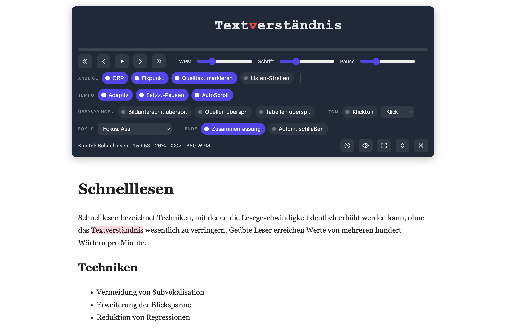
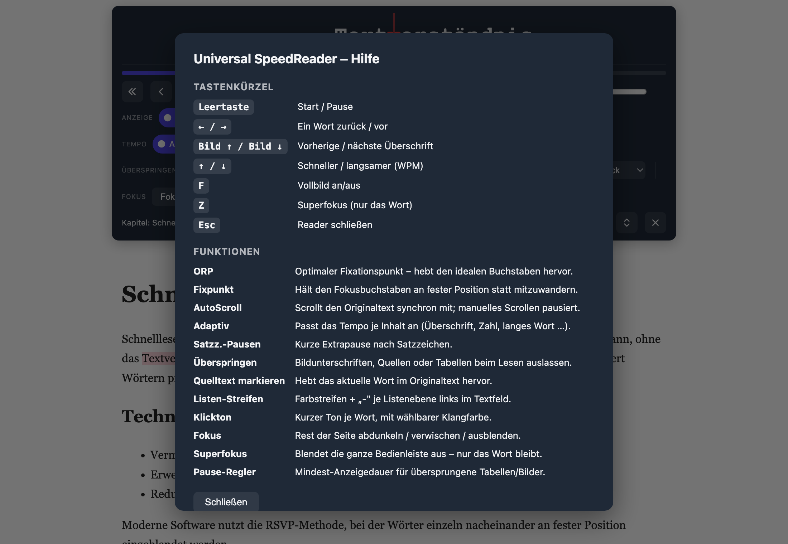

# Universal SpeedReader

Ein produktionsreifes Tampermonkey-Skript für RSVP-/ORP-Speedreading auf nahezu
jeder textbasierten Webseite. Wählt einen beliebigen HTML-Container, zerlegt
dessen Inhalt in Wörter/Blöcke und zeigt sie im RSVP-Tempo an — synchron mit
sanftem Auto-Scroll des Originaltextes.

## Installation

1. [Tampermonkey](https://www.tampermonkey.net/) (oder kompatiblen Userscript-
   Manager) installieren.
2. [`universal-speedreader.user.js`](universal-speedreader.user.js) importieren —
   entweder im Tampermonkey-Dashboard unter „Neues Skript" den Inhalt einfügen,
   oder die Roh-Datei direkt öffnen (`@updateURL`/`@downloadURL` sorgen für
   automatische Updates).

## Nutzung

1. Auf der Zielseite erscheint unten rechts ein schwebender ⚡-Button.
2. Klick aktiviert den Auswahlmodus — Container unter der Maus werden
   hervorgehoben, `Esc` bricht ab.
3. Klick auf einen Container startet den Reader.
4. Steuerung über die fixierte Bedienleiste oder per Tastatur (siehe unten).
   Das **?-Icon** in der Leiste öffnet jederzeit eine Hilfe mit allen Funktionen
   und Kürzeln. Längeres Verweilen auf einem Bedienelement zeigt einen Hinweis.

Pro Seite kann jeweils nur eine Reader-Session aktiv sein. Die Leiste reserviert
Platz am Seitenrand, sodass sie keinen Inhalt verdeckt, und lässt sich nach oben
oder unten verschieben.

### Tastenkürzel

| Taste | Funktion |
| --- | --- |
| `Leertaste` | Start / Pause |
| `←` / `→` | Ein Wort zurück / vor |
| `⇧←` / `⇧→` | Vorherige / nächste Überschrift |
| `Bild↑` / `Bild↓` | Überschrift (Alternative) |
| `↑` / `↓` | Schneller / langsamer (WPM) |
| `F` | Vollbild an/aus |
| `Z` | Superfokus (nur das Wort) |
| `Esc` | Reader schließen |

Buchstaben-Kürzel arbeiten layout-unabhängig (funktionieren also auch auf
QWERTZ-Tastaturen).

## Bedienleiste

Die Optionen sind thematisch gruppiert:

- **Anzeige** — ORP, Fixpunkt, Quelltext-Markierung, Listen-Streifen
- **Tempo** — Adaptiv, Satzzeichen-Pausen, AutoScroll
- **Überspringen** — Bildunterschriften, Quellen/Fußnoten, Tabellen
- **Ton** — Klickton je Wort mit wählbarer Klangfarbe
- **Fokus** — restliche Seite abdunkeln / verwischen / ausblenden
- **Ende** — Zusammenfassung anzeigen, automatisch schließen

Die letzte Zeile zeigt Laufzeit-Infos (Kapitel, gelesene Wörter, Fortschritt,
Restzeit, WPM, Listenebene) sowie die Aktions-Buttons: Hilfe, Superfokus,
Vollbild, Position und Schließen.

## Funktionen

- DOM-Parser erkennt Überschriften, Absätze, Listen, Tabellen, Bilder, Videos,
  Code(-blöcke), Blockquotes, Details/Summary, MathJax/KaTeX, SVG, Canvas,
  Fußnoten und Zitate; loser Text in generischen Containern wird ebenfalls
  erfasst, unsichtbare (z. B. `display:none`) Bereiche werden übersprungen.
- **ORP** (Optimal Recognition Point) mit optional fixiertem Fokuspunkt und
  Referenzlinie; sehr lange Wörter werden automatisch verkleinert statt
  umzubrechen.
- **Adaptive Lesegeschwindigkeit** je Blocktyp, Satzzeichen-Pausen, Extra-Zeit
  für Zahlen und lange Wörter.
- **Quelltext-Markierung**: das aktuelle Wort wird zusätzlich im Originaltext
  hervorgehoben.
- **Listen-Streifen**: dezenter Farbstreifen samt „-"-Markierung je
  Verschachtelungsebene links im Textfeld.
- **Übersprungene** Tabellen/Bilder erscheinen als kurzer Platzhalter mit
  einstellbarer Mindestpause.
- **Fokus-** und **Superfokus-Modus** sowie echter Seiten-**Vollbildmodus**.
- Sanftes, wortgenaues Auto-Scrolling; manuelles Scrollen pausiert automatisch
  und springt beim Fortsetzen zurück zur Leseposition.
- Optionaler **Klickton** je Wort mit mehreren Klangfarben.

  > 🥚🎵 Tipp: Probier ruhig alle Klangfarben aus — bei einer davon könntest du
  > überrascht werden. Es könnte dir gefallen. 😉
- **Statistik** nach Sitzungsende (Gesamtzeit, Ø-WPM, effektive WPM, Wortzahl,
  geschätzte Zeitersparnis) — optional, mit optionalem Auto-Schließen.
- Einstellbare Schriftgröße, Toolbar-Position und Theme.
- Alle Einstellungen persistieren über `GM_setValue`/`GM_getValue`, inklusive
  letzter Leseposition je Seite.

## Architektur

Einzelne `.user.js`-Datei, intern in klar getrennte ES2022-Klassen gegliedert
(Utils, SettingsManager, EventBus, Tokenizer, Block-Modell, DomParser,
SpeedModel, ORP, ScrollEngine, ReaderEngine, UI-Komponenten,
KeyboardController, App). Details siehe Kopfkommentar in
[`universal-speedreader.user.js`](universal-speedreader.user.js) und
[`plan.md`](plan.md) für die ursprüngliche Spezifikation.

## Lizenz

[MIT](LICENSE)
